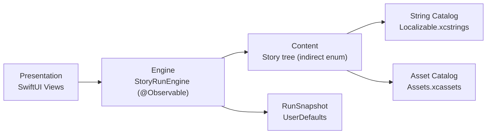
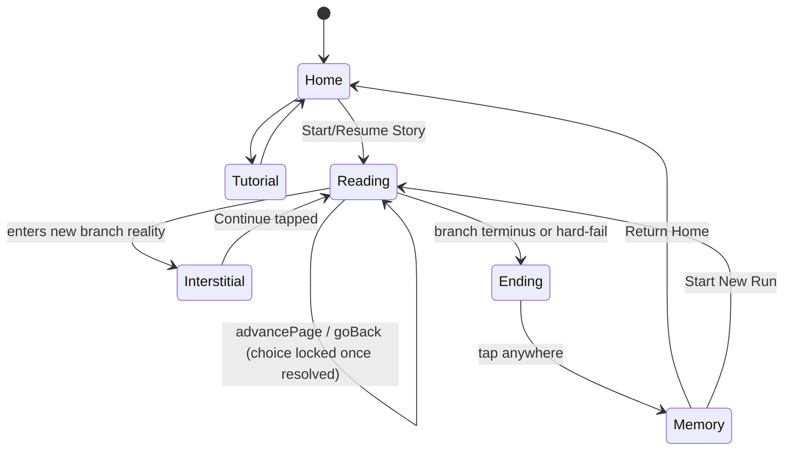

# Architecture Spine — Forked Echoes v1

## Design Paradigm

Three layers, one direction of dependency:

- **Content** — the story tree and its assets. Structure (nodes, choices, ending kind, alignment deltas, echo wiring) is Swift `indirect enum` data — a compiled, type-checked tree. Prose and all player-facing text live in a String Catalog; illustrations live in an Asset Catalog. Content has zero dependencies on the layers above it.
- **Engine** — `StoryRunEngine`, a single `@Observable` object. The sole owner and mutator of run state (current position, locked choice history, alignment score). Depends only on Content.
- **Presentation** — SwiftUI views (Home, Tutorial, Story/Choice, Interstitial, Ending, Memory). Read Engine state, render it, and forward every user action to Engine as an intent call. Never traverse Content directly and never mutate run state directly.

Maps to source tree: `Content/`, `Engine/`, `Views/` (see Structural Seed).

## Invariants & Rules

### AD-1 — Content structure is a compiled Swift tree, not external data

- **Binds:** content model, FR-4, FR-5, FR-6, FR-8
- **Prevents:** a branch that fails to terminate in one of the four ending types, or a dangling echo/choice reference — both become impossible to compile rather than a runtime bug to catch.
- **Rule:** Story topology (nodes, choice targets, ending kind, alignment deltas, echo wiring) is authored as Swift `indirect enum` literals in `Content/`. Every recursive case resolves to either a choice node or a terminal ending case; there is no representable "dead end." Content types are never `Decodable` from a runtime-loaded file. The tree never reconverges (no two choice paths merge back into a shared node) — this is what lets echo-callback text be a static, per-node authoring property (baked in at write time, referencing a specific earlier choice by construction) rather than something computed at runtime from a choice-history lookup; a node's position in the tree already encodes its full ancestry. Ending kind is authored directly on each terminal node — the tree's compile-time shape is what guarantees FR-8 (a branch always terminates in exactly one ending type). Alignment deltas carried on choice edges are separate, unrelated data used only for the Memory-screen display stat (FR-7) — they play no role in which terminal node a path reaches.

### AD-2 — Prose and text are content, but live outside the tree

- **Binds:** content model, localization, FR-11, FR-12
- **Rule:** All player-facing text (body prose, choice labels, echo callbacks, tutorial/ending copy, VoiceOver labels) lives in an Xcode String Catalog (`Localizable.xcstrings`), referenced from `Content/` nodes by stable key via `LocalizedStringResource`, with type-safe generated symbols enabled. Illustrations live in `Assets.xcassets`, one image set per branch-reality flavor, referenced via generated `ImageResource` symbols — never raw string names.
- **Prevents:** localization requiring changes to tree structure; a typo'd string or asset key failing only at runtime.

### AD-3 — StoryRunEngine is the single owner of run state

- **Binds:** all screens (Home, Tutorial, Story/Choice, Ending, Memory), FR-3, FR-4, FR-5, FR-7, FR-10
- **Prevents:** run state (current position, choice history, alignment score) fragmenting across per-screen ViewModels that must stay in sync; views mutating state directly instead of through a defined intent surface.
- **Rule:** One `@Observable` `StoryRunEngine`, injected via `@Environment`, is the sole mutator of run state. Its full intent surface: `selectChoice(_:)`, `advancePage()` (also serves as "Continue" past the branch-arrival interstitial and "tap to continue" past Ending — the same "move forward past the current blocking beat" intent in all three phases), `goBack()`, `exitToHome()` (non-destructive, preserves the snapshot), `restartRun()` (mid-run, destructive, requires the confirmation EXPERIENCE.md specifies), `startNewRun()` (from Memory, post-completion, no confirmation needed). Views never write engine state directly. Every interaction path that expresses the same user intent — gesture, its accessible tap equivalent, and its VoiceOver custom action alike (FR-11) — invokes the *same* intent method; these are never separate code paths that could diverge.

  A choice's press-and-hold charge and its tap-then-1.5s-undo-window (`DESIGN.md.components.choice-card`) are entirely View-local, transient, uncommitted state (`@State`) — `selectChoice(_:)` fires exactly once, at the moment the interaction finalizes (charge completes, or the undo window elapses without a cancel), never eagerly and never revocably. If the app terminates before finalization, nothing reached the engine — relaunch shows the same choice page, undecided.

  Engine exposes current content to views as a rendering projection (resolved node: prose keys, choice list, illustration reference, and whether this page is currently firing an echo, so the view knows to power up the frame) — views never import or traverse the `Content` tree type directly.

### AD-4 — Run state persists as one Codable snapshot in UserDefaults

- **Binds:** StoryRunEngine, Home resume/restart, run-options action sheet
- **Prevents:** over-engineered persistence (files, Core Data, SwiftData) for a state blob this small; losing an in-progress run across a relaunch.
- **Rule:** `RunSnapshot` is `Codable`, JSON-encoded, stored under one `UserDefaults` key: `currentNodeId: NodeID`, `choiceHistory: [ChoiceRecord]` (each a `{ nodeId: NodeID, chosenOptionId: OptionID }` pair — IDs only, never frozen prose; Memory re-resolves display text from the current String Catalog via those IDs at render time per AD-2, so a content edit between builds never strands stale text in an old snapshot), `alignmentScore: Int`, `tutorialSeen: Bool`.

  Writes are synchronous and immediate on every completed mutating intent — never debounced — so no in-progress page is ever lost to abrupt termination. A decode failure (corrupt data, or a `currentNodeId` that no longer exists after a content update) is treated identically to "no snapshot": the engine falls back to a fresh run rather than crashing.

  `RunSnapshot` represents an **in-progress run only**: reaching the Ending phase clears it (a completed run has nothing to resume), and `restartRun()`/`startNewRun()` clear it as part of resetting to the initial node. Home's "Resume Story" vs. "Start Story" relabel is driven purely by snapshot presence — a finished run always presents fresh.

### AD-5 — The story pager is engine-driven, not a native paging container

- **Binds:** navigation, StoryRunEngine, Story/Choice view, FR-3
- **Prevents:** forcing tree-shaped, choice-gated content into `NavigationStack` push/pop or `TabView(.page)` — both assume a fixed, known page list and have no clean hook to block forward navigation on an external condition.
- **Rule:** `StoryRunEngine` owns "what is currently displayed" as a phase, **derived from the current node's type** (not decided by a separate look-ahead step) — reading a node / branch-arrival interstitial / ending / memory; see the state diagram below. Because phase is derived, a hard-fail transitions to Ending the instant `selectChoice(_:)` targets an Ending-kind node, not on some later `advancePage()` discovery. Swipe gestures and the invisible tap zones both call `advancePage()` / `goBack()`, and are only attached to the reading surface — the interstitial exposes no swipe/tap-zone recognizers at all, responding only to its own tap-to-continue affordance (`EXPERIENCE.md`'s "blocks page-turn gestures until dismissed"). Interstitial is a derived, non-persisted phase, not a distinct RunSnapshot state: if the app terminates while it's showing, relaunch resumes straight into the node's reading content without re-showing the arrival announcement. The engine decides whether a reading transition is allowed (blocks forward on an unresolved choice; shows a revisited choice locked, per FR-5) and the view transitions its content via `.transition`/`.animation` in response. `NavigationStack`, if used at all, is reserved for the coarse top-level flow (Home ↔ Tutorial ↔ Story session ↔ Ending ↔ Memory) and never wraps individual story pages.

### AD-6 — Ending kind is a direct property of the terminal node reached

- **Binds:** StoryRunEngine, content model (terminal node ending kind), FR-8
- **Prevents:** re-deriving "which ending is this" from score math anywhere in the engine — there is no threshold to duplicate or drift, because the tree's shape (AD-1) already fixes it at author-time.
- **Rule:** Every terminal node in `Content/` carries its `EndingKind` (home/stay/limbo/hard-fail) directly, fixed at write-time. When the engine's current node is a terminal node, the run's ending is simply that node's `EndingKind` — no computation involved. Hard-fail terminal nodes are reached only via a designated gotcha choice; every other terminal node is reached through ordinary branch traversal. Alignment score (accumulated per AD-3/AD-4) plays no role in which terminal node a path reaches — it is carried purely as Memory-screen display data (FR-7, FR-10).

### AD-7 — Testing surface

- **Binds:** StoryRunEngine, ending resolution, persistence
- **Prevents:** engine logic shipping unverified. (An earlier draft of this spine built ending resolution around a score-threshold function; that mechanism was a misreading of the original design intent, caught and corrected before implementation began — see `addendum.md`'s correction note. This test surface verifies the corrected, simpler contract instead.)
- **Rule:** Swift Testing covers `StoryRunEngine` logic: every terminal node in the content tree resolves to exactly one `EndingKind` with no ambiguity (FR-8), echo-callback reachability as authored in the tree, hard-fail terminal nodes reachable only via their designated gotcha choice, pager-gating (forward blocked on an unresolved choice; back-navigation shows a decided choice locked, per FR-5), and `RunSnapshot` encode/decode round-trip (including the alignment-score field, verified only for correct accumulation/persistence, not for any ending-resolution role). No automated UI-test requirement beyond the manual/VoiceOver playtesting FR-11 already calls for.

### AD-8 — Landscape is a continuous layout reflow, detected via vertical size class, not a distinct engine phase or code path

- **Binds:** all screens (Home, Tutorial, Story/Choice, Ending, Memory), Presentation layer, FR-11, PRD §4.6 Orientation NFR
- **Prevents:** duplicate view hierarchies per orientation (e.g. a separate `LandscapeHomeView` alongside `HomeView`); brittle `UIDevice.orientation`/`UIDeviceOrientationDidChangeNotification` observation, which doesn't map cleanly onto SwiftUI's declarative environment model and requires manual lifecycle handling; misclassifying orientation via `horizontalSizeClass`, which reports `.compact` in *both* portrait and landscape on standard (non-Plus/Max) iPhones and so cannot distinguish the two.
- **Rule:** Every screen is a single SwiftUI view hierarchy that reflows continuously across orientation. Where a structural layout branch is needed (e.g. `choice-card` stack→row), the view reads `@Environment(\.verticalSizeClass)` (`.compact` = landscape, `.regular` = portrait — reliable across all iPhone sizes, unlike `horizontalSizeClass`) and branches inline (e.g. a conditional modifier or `Group`) — never a second view type or file. Where only geometry changes (e.g. `reading-surface`'s landscape column-width cap), express it as a plain `.frame(maxWidth:)`-style constraint that is simply a no-op in portrait, not a size-class branch at all. No orientation-specific view types, no `UIDevice.orientation` polling, no manual rotation lifecycle code anywhere in `Views/`. `verticalSizeClass` is `Optional` — if it is ever `nil` (e.g. a view instantiated outside a window scene, such as certain preview contexts with no explicit size-class override), treat it as `.regular` (portrait), the safer default since no orientation-dependent layout should ever silently assume the more space-constrained landscape branch. `StoryRunEngine`'s phase model (AD-5) is orientation-agnostic and untouched by this — landscape is a Presentation-layer-only concern.

### Dependency Direction



No arrow points from Content or Engine back toward Views; Views never import Content directly (AD-3).

## Consistency Conventions

| Concern | Convention |
| --- | --- |
| Naming | Content node/choice IDs are Swift enum cases. String Catalog keys are namespaced by node id + role (`story.<nodeId>.body`, `story.<nodeId>.choice.<n>`). Illustration asset names match branch-reality flavor identifiers 1:1, consumed only via generated `ImageResource` symbols. |
| Data & formats | `RunSnapshot` is the only persisted data shape: `currentNodeId`, `choiceHistory: [ChoiceRecord]`, `alignmentScore: Int`, `tutorialSeen: Bool`. No timestamps or multi-session history — one run, one snapshot. |
| State & cross-cutting | `StoryRunEngine` is the sole mutator of run state (AD-3). No auth, no networking, no logging backend (on-device only, per PRD platform constraint). Impossible engine states (e.g. advancing past an unresolved choice) are prevented by the type system and engine guard logic, not caught and recovered from at runtime. |
| Implementation rules & AI-agent conventions | Codified in `_bmad-output/project-context.md` (localization, navigation, landscape/`verticalSizeClass`, the `GeometryReader`+`ScrollView` centering idiom, testing scope, Dynamic Type, design-token/magic-number sourcing, button styling, file organization) — auto-loaded by `create-story`/`dev-story`. This spine states the architectural *why*; that file states the implementation-level *how*, distilled from patterns established across Stories 1.1–1.5, 5.2, 5.3. |

## Stack

| Name | Version |
| --- | --- |
| Swift | 6.3 |
| iOS deployment target | 18.0 minimum (N-1) / iOS 26 SDK (N) |
| Xcode | 26.6 |
| SwiftUI | Bundled, iOS 26 SDK |
| Swift Testing | Bundled, Xcode 16+ / Swift 6+ |

Current-stable as of authoring (2026-07-25); Xcode 27/Swift 6.4 entered public beta ~2 weeks prior (GA expected ~September 2026). Re-verify exact point releases before starting implementation — this table is seed, not a pin the code should inherit unexamined.

## Structural Seed

```text
ForkedEchoes/
  App/                    # App entry point, scene setup
  Content/                # Swift indirect enum story tree; alignment deltas; echo wiring
  Engine/                 # StoryRunEngine, RunSnapshot, persistence
  Views/                  # Home, Tutorial, Story/Choice, Interstitial, Ending, Memory
  Resources/
    Localizable.xcstrings
    Assets.xcassets       # branch-reality illustrations, one image set per flavor
ForkedEchoesTests/        # Swift Testing: engine logic, ending resolution, persistence round-trip
```

**Run phase (engine-owned):**



**Device target:** iPhone only for v1, supporting both portrait and landscape orientation — the single-column reading surface `EXPERIENCE.md` specifies reflows for landscape rather than assuming portrait-only. iPad/Universal is not excluded by anything architectural, just not designed for; see Deferred.

**Landscape layout strategy** (AD-8): Both orientations reflow from one SwiftUI view hierarchy per screen — orientation is detected via `verticalSizeClass` (never `UIDevice.orientation` or `horizontalSizeClass`, see AD-8). The reading surface (Story/Choice, Tutorial, Ending, Memory) caps at `680px`/`{components.reading-surface.column-max-width-landscape}` and centers, so extra screen width becomes side margin rather than longer lines. Choice cards switch from a vertical stack to a horizontal row, wrapping to a 2+1 layout once a label would exceed 2 lines or at accessibility Dynamic Type sizes — a hard constraint, not an implementation-time judgment call. The circuit frame, Home/Tutorial's centered stack, and the branch-arrival interstitial all reflow their existing geometry to the new aspect ratio — no new component types are introduced for landscape. The 44pt minimum tap target and the frame-well's Dynamic Type headroom clearance hold identically in both orientations. Full behavioral spec: `EXPERIENCE.md#Responsive and Platform`; token values: `DESIGN.md#Layout & Spacing` (Landscape paragraph), `DESIGN.md#Components` (`reading-surface`, `choice-card.layout-landscape`). This paragraph names the components Story 5.1 explicitly designed for; AD-8's general rule still governs any component not yet named here (e.g. Epic 2/3's not-yet-built screens) — no story may hard-code a portrait-only layout assumption for a new component, even one absent from this list.

**Deployment & environments:** Single Xcode app target; Debug/Release configurations only. No backend, server, or infra of any kind — fully on-device (PRD platform constraint). Distribution via App Store Connect; TestFlight for solo/friends playtesting pre-submission. Apple Developer Program enrollment is a **blocking prerequisite** for any TestFlight or App Store distribution and is not yet in place (PRD Open Question 5) — tracked here as an unresolved dependency, not something this spine can close.

## Capability → Architecture Map

| Capability | Lives in | Governed by |
| --- | --- | --- |
| FR-1 Home entry | `Views/Home` | AD-3, AD-4 (Resume/Start relabel), AD-8 |
| FR-2 Tutorial | `Views/Tutorial` | AD-3, AD-8 |
| FR-3 Page navigation | `Engine` (advancePage/goBack), `Views/StoryChoice` | AD-5, AD-8 |
| FR-4 Choice presentation & selection | `Content` (choice cases), `Engine` (selectChoice) | AD-1, AD-3 |
| FR-5 Choice permanence | `Engine` (locked choice history) | AD-3, AD-5 |
| FR-6 Narrative callback (echo) | `Content` (echo wiring) | AD-1, AD-7 |
| FR-7 Silent alignment scoring | `Engine` (score accumulation, never exposed) | AD-3 |
| FR-8 Ending resolution | `Content` (per-node `EndingKind`), `Engine` (hard-fail bypass transition) | AD-1, AD-6 |
| FR-9 Ending screen | `Views/Ending` (one shared template) | AD-3, AD-8 |
| FR-10 Memory/recap | `Engine` (choice history), `Views/Memory` | AD-3, AD-4, AD-8 |
| FR-11 Accessible interaction parity | `Views` (VoiceOver/Dynamic Type), `Resources/Localizable.xcstrings` (a11y labels) | AD-2, AD-3, AD-8 |
| FR-12 Bundled illustrations | `Resources/Assets.xcassets` | AD-2 |

## Deferred

- **Story scale** (branch count, choice-point count, playtime) — a content-planning decision, not an architecture concern (PRD Open Question 1).
- **Exact gesture vocabulary** beyond swipe/hold — governed by `DESIGN.md`/`EXPERIENCE.md`, not this spine (PRD Open Question 2, already resolved at UX-spec altitude).
- **App Store content rating** — resolved before submission, not an architecture decision (PRD Open Question 3).
- **Apple Developer Program enrollment** — blocking prerequisite for deployment (PRD Open Question 5); tracked under Structural Seed above, unresolved.
- **v1.1+ scope** (deviation meter, anchor points, certainty resource, undo credit, telemetry) — explicitly out of scope per PRD §6.2. Telemetry in particular would require revisiting AD-3/Consistency Conventions' "no networking" stance if ever pulled into scope — not designed for here.
- **Second-language translation** — AD-2 builds the localization *seam* (String Catalog), but shipping an actual second language is not a v1 commitment; revisit only if the PRD scopes it explicitly.
- **iPad/Universal support** — v1 targets iPhone only (see Structural Seed); revisit if the product direction wants a larger-screen reading layout.
